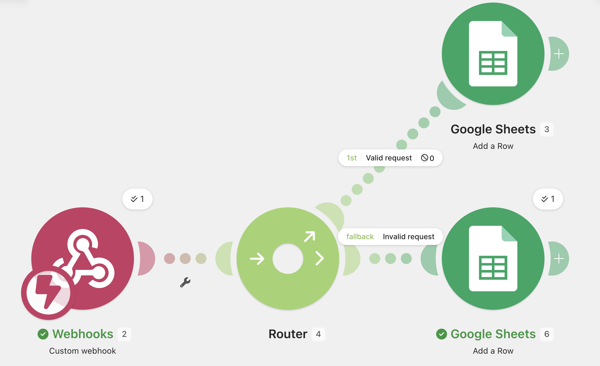
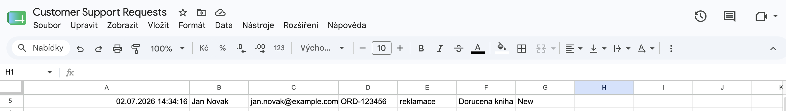
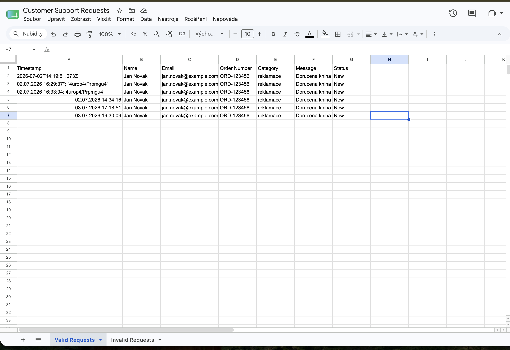

# E-commerce Customer Support Automation

Modelová automatizace pro příjem a evidenci zákaznických požadavků v e-commerce.

## Jak automatizace funguje

1. Webhook v Make přijme zákaznický požadavek ve formátu JSON.
2. Make rozpozná jednotlivé hodnoty požadavku.
3. Data jsou automaticky zapsána jako nový řádek do Google Sheets.
4. Každému požadavku je přiřazen čas přijetí a stav `New`.

## Přenášená data

- jméno zákazníka
- e-mail
- číslo objednávky
- kategorie požadavku
- zpráva
- čas přijetí
- stav požadavku

## Použité technologie

- Make
- Webhooks
- HTTP / JSON
- Google Sheets
- curl

## Workflow



## Výsledek



## Řešený problém

Při prvním testování se čas ukládal v nečitelném ISO formátu. Následně byla upravena funkce pro formátování data a nastaveno české časové pásmo.

{{formatDate(now; "DD.MM.YYYY HH:mm:ss"; "Europe/Prague")}}

Výsledkem je čitelný čas ve formátu:

02.07.2026 16:35:38



## Testovací vstup

```json
{
  "name": "Jan Novak",
  "email": "jan.novak@example.com",
  "order_number": "ORD-123456",
  "category": "reklamace",
  "message": "Dorucena kniha ma poskozeny obal."
}
